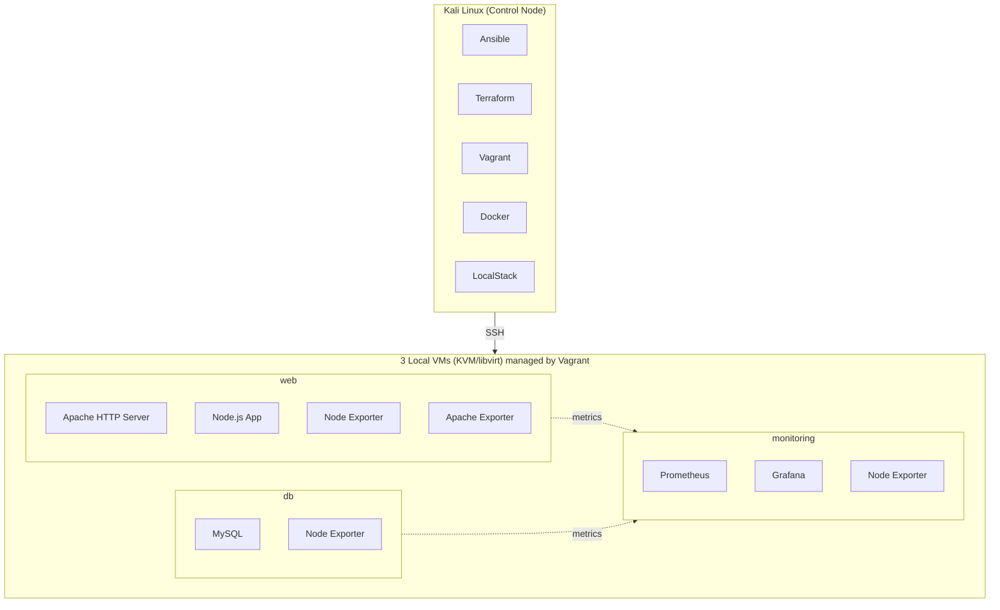

# AWS IaC Monitoring Stack

> **Work in progress** — Initial project structure.

A complete Infrastructure as Code (IaC) stack that deploys a 3-tier
architecture (web, database, monitoring) using **Vagrant** for local
provisioning and **Ansible** for configuration, with full monitoring
via **Prometheus** and **Grafana**.

## Goal

Demonstrate hands-on expertise with automation and Infrastructure as Code
tools through a real, reproducible, and well-documented project.

## Architecture



## Tech Stack

| Layer              | Tool                          | Purpose                          |
| ------------------ | ----------------------------- | -------------------------------- |
| Local provisioning | Vagrant + KVM/libvirt         | Create reproducible VMs          |
| Configuration      | Ansible                       | Install and configure software   |
| Web server         | Apache HTTP Server            | Serve the application            |
| Database           | MySQL                         | Data persistence                 |
| Monitoring         | Prometheus                    | Metrics collection               |
| Visualization      | Grafana                       | Dashboards                       |
| Exporters          | Node Exporter, Apache Exporter| System and web metrics           |
| CI/CD              | GitHub Actions                | Automated validation             |
| AWS emulation      | LocalStack                    | Simulate AWS services locally    |

## Requirements

Before you start, make sure you have the following tools installed:

| Tool        | Minimum version | Check                  |
| ----------- | --------------- | ---------------------- |
| Git         | 2.30            | `git --version`        |
| Python      | 3.10            | `python3 --version`    |
| jq          | 1.6             | `jq --version`         |
| AWS CLI     | 2.0             | `aws --version`        |
| Terraform   | 1.5             | `terraform --version`  |
| Ansible     | 2.15            | `ansible --version`    |
| Docker      | 20.10           | `docker --version`     |
| Vagrant     | 2.3             | `vagrant --version`    |
| KVM/libvirt | 8.0             | `virsh --version`      |
| LocalStack  | 3.0             | `localstack --version` |

### Automated verification

Run the verification script:

```bash
chmod +x scripts/check-requirements.sh
./scripts/check-requirements.sh
```

This script detects which tools are missing or outdated and offers to
install them automatically.

## Project Structure

```
aws-iac-monitoring-stack/
├── .github/workflows/    # CI/CD pipelines
├── vagrant/              # Local provisioning (Day 0)
├── terraform/            # Cloud provisioning (Phase 2, optional)
├── ansible/              # Server configuration (Day 1-2)
│   ├── inventories/      # Host inventories per environment
│   ├── group_vars/       # Group-specific variables
│   ├── roles/            # Reusable roles
│   └── playbooks/        # Orchestration playbooks
├── scripts/              # Utility scripts
├── docs/                 # Detailed documentation
└── logs/                 # Local logs (git-ignored)
```

## Quick Start

### 1. Clone the repository

```bash
git clone https://github.com/your-username/aws-iac-monitoring-stack.git
cd aws-iac-monitoring-stack
```

### 2. Verify requirements

```bash
./scripts/check-requirements.sh
```

### 3. Bring up the lab

```bash
cd vagrant
vagrant up
```

### 4. Configure the servers

```bash
cd ../ansible
ansible-playbook playbooks/site.yml
```

### 5. Access Grafana

Open <http://192.168.56.30:3000> in your browser.

- **Username:** `admin`
- **Password:** see `ansible/group_vars/all/vault.yml`

## Documentation

- [Setup Guide](docs/SETUP.md)
- [Architecture](docs/ARCHITECTURE.md)
- [Technical Decisions](docs/DECISIONS.md)

## Roadmap

- [x] Initial project structure
- [ ] Vagrantfile for 3 local VMs (web, db, monitoring)
- [ ] Ansible inventory and base configuration
- [ ] `common` role (baseline server setup)
- [ ] `apache` role (web server)
- [ ] `database` role (MySQL)
- [ ] `node_exporter` role
- [ ] `prometheus` role
- [ ] `apache_exporter` role
- [ ] `grafana` role
- [ ] CI/CD pipeline with GitHub Actions
- [ ] Terraform + LocalStack (Phase 2)
- [ ] Migration guide to AWS (Phase 3)

## Contributing

This is a personal portfolio project, but suggestions and feedback are
welcome. Feel free to open an issue or submit a PR.

## License

MIT
