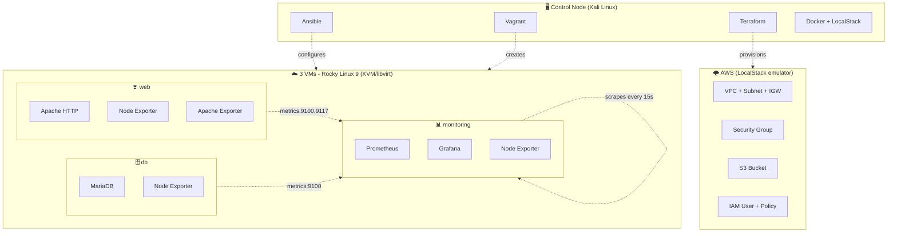
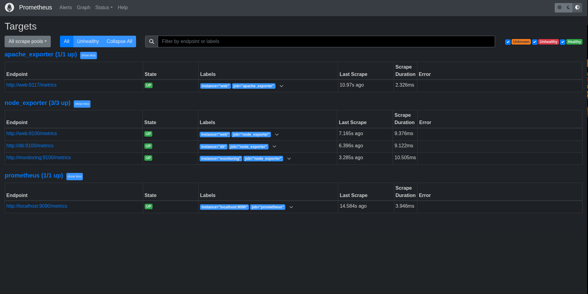
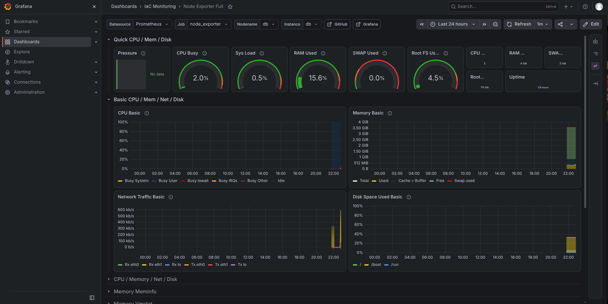
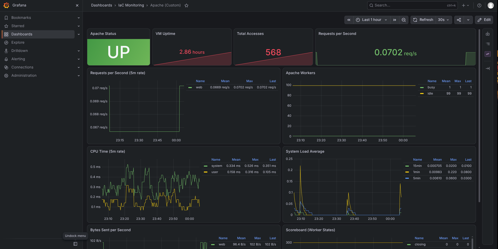
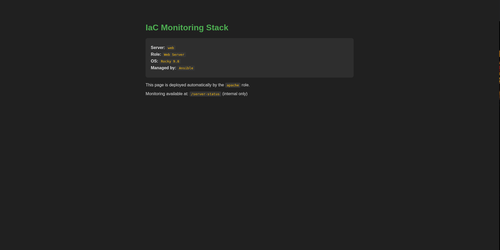

# AWS IaC Monitoring Stack

> A complete Infrastructure as Code (IaC) project that provisions and configures
> a 3-tier monitoring stack using **Vagrant**, **Ansible**, **Terraform**, and
> **Prometheus/Grafana** — all running locally without cloud costs.

[](https://www.ansible.com/)
[](https://www.terraform.io/)
[](https://www.vagrantup.com/)
[](https://prometheus.io/)
[](https://grafana.com/)
[](LICENSE)

---

## 📋 Table of Contents

- [Overview](#-overview)
- [Architecture](#-architecture)
- [Stack](#-stack)
- [Features](#-features)
- [Screenshots](#-screenshots)
- [Quick Start](#-quick-start)
- [Project Structure](#-project-structure)
- [Documentation](#-documentation)
- [Testing](#-testing)
- [Roadmap](#-roadmap)
- [License](#-license)

---

## 🎯 Overview

This project demonstrates hands-on expertise with **Infrastructure as Code**,
**configuration management**, and **observability** by building a realistic
3-tier infrastructure from scratch:

- **3 Rocky Linux 9 VMs** provisioned with **Vagrant + KVM/libvirt**
- **7 Ansible roles** configuring every layer of the stack
- **Apache + MariaDB** serving a web application and storing data
- **Prometheus + Grafana** collecting and visualizing metrics from all hosts
- **Terraform + LocalStack** provisioning AWS resources (VPC, S3, IAM, SG)
- **Zero cloud costs** — everything runs locally

**Goal:** Build a portfolio project that reflects real-world DevOps practices:
idempotent automation, modular code, monitoring-first design, and complete
documentation.

---

## 🏗️ Architecture



---

## 🛠️ Stack

| Layer | Technology | Purpose |
|---|---|---|
| **Provisioning (local)** | Vagrant + KVM/libvirt | Create 3 reproducible VMs |
| **Provisioning (cloud)** | Terraform + LocalStack | Emulate AWS resources |
| **Configuration** | Ansible | Install & configure services |
| **Web server** | Apache HTTP Server | Serve the app + mod_status |
| **Database** | MariaDB | Persist application data |
| **Monitoring** | Prometheus | Collect time-series metrics |
| **Visualization** | Grafana | Dashboards & alerting |
| **Exporters** | node_exporter, apache_exporter | Expose metrics |
| **CI/CD** | GitHub Actions | Lint & validate on push |

---

## ✨ Features

- ✅ **Fully idempotent** Ansible playbooks (`changed=0` on re-runs)
- ✅ **Modular roles** for every service (7 roles)
- ✅ **Hostname-based targets** in Prometheus (no hardcoded IPs)
- ✅ **Provisioned Grafana** with datasources & dashboards as code
- ✅ **Ansible Vault** ready for secrets management
- ✅ **Hardened systemd units** for all exporters
- ✅ **Terraform modules** reusable across environments
- ✅ **LocalStack** for AWS emulation without costs
- ✅ **Troubleshooting guide** documenting real issues solved

---

## 📸 Screenshots

### Prometheus Targets (5 UP)



### Grafana — Node Exporter Full



### Grafana — Apache Custom Dashboard



### Apache Web Page (deployed by Ansible)



---

## 🚀 Quick Start

### Prerequisites

| Tool | Minimum Version | Check |
|---|---|---|
| Git | 2.30 | `git --version` |
| Python | 3.10 | `python3 --version` |
| Vagrant | 2.3 | `vagrant --version` |
| Ansible | 2.15 | `ansible --version` |
| Terraform | 1.5 | `terraform --version` |
| Docker | 20.10 | `docker --version` |
| KVM/libvirt | 8.0 | `virsh --version` |
| LocalStack | 3.0 | `localstack --version` |

### Automatic validation

```bash
chmod +x scripts/check-requirements.sh
./scripts/check-requirements.sh
```

### Bring up the lab

```bash
# 1. Clone
git clone git@github.com:Gryphodt/aws-iac-monitoring-stack.git
cd aws-iac-monitoring-stack

# 2. Create the VMs
cd vagrant && vagrant up && cd ..

# 3. Configure everything with Ansible
cd ansible && ansible-playbook playbooks/site.yml && cd ..

# 4. Provision AWS resources with Terraform (LocalStack)
localstack start -d
cd terraform/environments/localstack
terraform init && terraform apply
```

### Access the stack

| Service | URL | Credentials |
|---|---|---|
| **Grafana** | http://192.168.56.30:3000 | `admin` / `admin` |
| **Prometheus** | http://192.168.56.30:9090 | — |
| **Web app** | http://192.168.56.10 | — |

> 💡 **Note:** IPs are shown here for reference only. All internal
> configurations use **hostnames** (`web`, `db`, `monitoring`) for portability.

---

## 📁 Project Structure

```
aws-iac-monitoring-stack/
├── ansible/                    # Configuration management
│   ├── roles/                  # 7 reusable roles
│   │   ├── common/             # Base configuration
│   │   ├── node_exporter/      # System metrics
│   │   ├── apache/             # Web server
│   │   ├── apache_exporter/    # Apache metrics
│   │   ├── database/           # MariaDB
│   │   ├── prometheus/         # Metrics collector
│   │   └── grafana/            # Dashboards
│   ├── playbooks/              # Playbook entrypoints
│   └── inventories/            # Per-environment inventories
├── terraform/                  # Cloud IaC (LocalStack)
│   ├── modules/                # Reusable modules
│   │   ├── vpc/                # Network
│   │   ├── security_group/     # Firewall rules
│   │   ├── s3/                 # Storage
│   │   └── iam/                # Identity & access
│   └── environments/localstack # Per-env config
├── vagrant/                    # VM provisioning
│   └── Vagrantfile             # 3-tier lab definition
├── scripts/                    # Utilities
│   └── check-requirements.sh   # Validate environment
├── docs/                       # Documentation
│   ├── ARCHITECTURE.md
│   ├── DECISIONS.md            # ADRs
│   ├── SETUP.md
│   ├── TROUBLESHOOTING.md
│   └── screenshots/
├── .github/workflows/          # CI/CD
└── README.md
```

---

## 📚 Documentation

- **[Architecture](docs/ARCHITECTURE.md)** — Components, ports, data flows
- **[Setup Guide](docs/SETUP.md)** — Step-by-step installation
- **[Decisions](docs/DECISIONS.md)** — Architecture Decision Records
- **[Troubleshooting](docs/TROUBLESHOOTING.md)** — Common issues & fixes

---

## 🧪 Testing

### Idempotency check

Re-run the playbook — it should report `changed=0` everywhere:

```bash
cd ansible
ansible-playbook playbooks/site.yml
# Expected:
# db         : ok=20  changed=0  failed=0
# monitoring : ok=35  changed=0  failed=0
# web        : ok=29  changed=0  failed=0
```

### Connectivity check

```bash
ansible all -m ping
# Expected: all hosts respond with "pong"
```

### Terraform drift detection

```bash
cd terraform/environments/localstack
terraform plan
# Expected: "No changes. Your infrastructure matches the configuration."
```

---

## 🗺️ Roadmap

- [x] Vagrant + KVM infrastructure
- [x] Ansible roles for all components
- [x] Prometheus + Grafana monitoring
- [x] Terraform modules for AWS (LocalStack)
- [ ] GitHub Actions CI/CD
- [ ] HTTPS with self-signed certificates
- [ ] Alertmanager integration
- [ ] Migrate to real AWS (optional)
- [ ] Kubernetes deployment (phase 3)

---

## 📄 License

MIT © [Gryphodt](https://github.com/Gryphodt)
